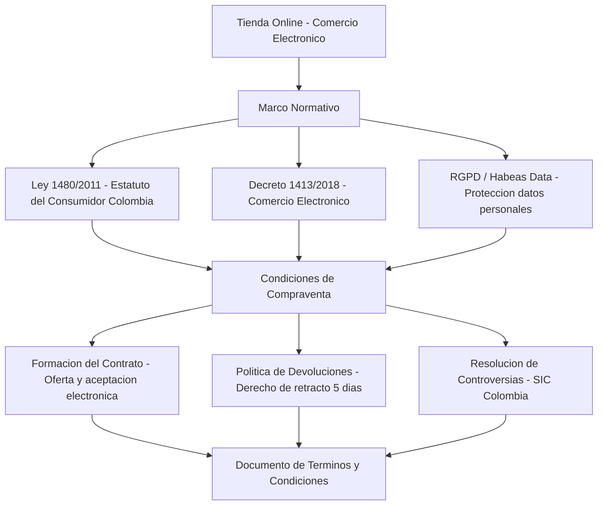

# Condiciones de Compraventa en una Tienda Online

> Análisis y redacción de condiciones legales de compraventa para comercio electrónico bajo normativa española/EU.

## Descripción

---

Proyecto de análisis jurídico y redacción de las **condiciones generales de contratación** para una tienda online conforme a la normativa española y europea: Ley de Servicios de la Sociedad de la Información (LSSI-CE), Directiva de Consumidores 2011/83/UE, Reglamento General de Protección de Datos (RGPD) y normativa de comercio electrónico.

## Cláusulas desarrolladas

1. **Información del vendedor:** Identificación, NIF, domicilio social
2. **Proceso de contratación:** Pasos del pedido y formación del contrato
3. **Precios y formas de pago:** IVA, medios aceptados, seguridad PCI-DSS
4. **Envío y entrega:** Plazos, zonas geográficas, transportistas
5. **Derecho de desistimiento:** Plazo de 14 días, exclusiones, reembolso
6. **Garantías:** Conformidad del producto, plazos legales
7. **Protección de datos:** Base legal, derechos ARCO-POL, DPO

## Contenido del repositorio

| Archivo | Descripción |
|---|---|
| `*.pdf` | Condiciones de compraventa completas |
| `*.docx` | Documento editable con cláusulas |

## Contexto académico

**Asignatura:** Comercio Electrónico y Aspectos Legales · **Institución:** Ingeniería Informática
**Autor:** Alejandro De Mendoza — Ingeniero Informático · Especialista Ingeniería de Software

---

## Arquitectura

## Autor

**Alejandro De Mendoza**  
Ingeniero Informático · Especialista en IA · Especialista en Ingeniería de Software · Máster en Arquitectura de Software

